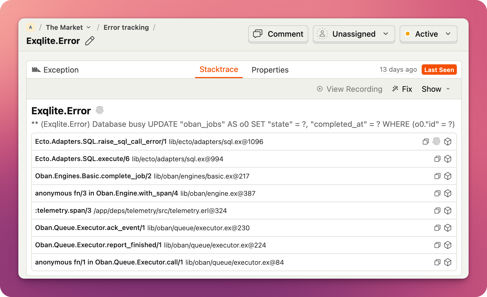

# PostHog Elixir SDK

[](https://hex.pm/packages/posthog)
[](https://hexdocs.pm/posthog)

A powerful Elixir SDK for [PostHog](https://posthog.com)

## Features

- Analytics and Feature Flags support
- Error tracking support
- Powerful process-based context propagation
- Asynchronous event sending with built-in batching
- Overridable HTTP client
- Support for multiple PostHog projects

## Getting Started

Add `PostHog` to your dependencies:

```elixir
def deps do
  [
    {:posthog, "~> 2.0"}
  ]
end
```

Configure the `PostHog` application environment:

```elixir
config :posthog,
  enable: true,
  enable_error_tracking: true,
  api_host: "https://us.i.posthog.com", # Or `https://eu.i.posthog.com` or your self-hosted PostHog instance URL
  api_key: "phc_my_api_key",
  in_app_otp_apps: [:my_app]
```

For test environment, you want to enable test_mode:

```elixir
config :posthog,
  test_mode: true
```

Optionally, enable [Plug integration](lib/posthog/integrations/plug.ex).

You're all set! 🎉 For more information on configuration, check the `PostHog.Config` module
documentation and the [advanced configuration guide](guides/advanced-configuration.md).

## Capturing Events

To capture an event, use `PostHog.capture/2`:

```elixir
iex> PostHog.capture("user_signed_up", %{distinct_id: "distinct_id_of_the_user"})
```

You can pass additional properties in the last argument:

```elixir
iex> PostHog.capture("user_signed_up", %{
  distinct_id: "distinct_id_of_the_user",
  login_type: "email",
  is_free_trial: true
})
```

## Special Events

`PostHog.capture/2` is very powerful and allows you to send events that have
special meaning. For example:

### Create Alias

```elixir
iex> PostHog.capture("$create_alias", %{distinct_id: "frontend_id", alias: "backend_id"})
```

### Group Analytics

```elixir
iex> PostHog.capture("$groupidentify", %{
  distinct_id: "static_string_used_for_all_group_events",
  "$group_type": "company",
  "$group_key": "company_id_in_your_db"
})
```

## Context

Carrying `distinct_id` around all the time might not be the most convenient
approach, so `PostHog` lets you store it and other properties in a _context_.
The context is stored in the `Logger` metadata, and PostHog will automatically
attach these properties to any events you capture with `PostHog.capture/3`, as long as they
happen in the same process.

```elixir
iex> PostHog.set_context(%{distinct_id: "distinct_id_of_the_user"})
iex> PostHog.capture("page_opened")
```

You can scope context by event name. In this case, it will only be attached to a specific event:

```elixir
iex> PostHog.set_event_context("sensitive_event", %{"$process_person_profile": false})
```

You can always inspect the context:

```elixir
iex> PostHog.get_context()
%{distinct_id: "distinct_id_of_the_user"}
iex> PostHog.get_event_context("sensitive_event")
%{distinct_id: "distinct_id_of_the_user", "$process_person_profile": true}
```

## Feature Flags

`PostHog.FeatureFlags.check/2` is the main function for checking a feature flag.

```elixir
# Simple boolean feature flag
iex> PostHog.FeatureFlags.check("example-feature-flag-1", "user123")
{:ok, true}

# Note how it automatically sets `$feature/example-feature-flag-1` property in the context
iex> PostHog.get_context()
%{"$feature/example-feature-flag-1" => true}

# It will attempt to take distinct_id from the context if it's not provided
iex> PostHog.set_context(%{distinct_id: "user123"})
:ok
iex> PostHog.FeatureFlags.check("example-feature-flag-1")
{:ok, true}

# You can also pass a map with body parameters that will be sent to the /flags API as-is
iex> PostHog.FeatureFlags.check("example-feature-flag-1", %{distinct_id: "user123", groups: %{group_type: "group_id"}})
{:ok, true}

# It returns variant if it's set
iex> PostHog.FeatureFlags.check("example-feature-flag-2", "user123")
{:ok, "variant2"}

# Returns error if feature flag doesn't exist
iex> PostHog.FeatureFlags.check("example-feature-flag-3", "user123")
{:error, %PostHog.UnexpectedResponseError{message: "Feature flag example-feature-flag-3 was not found in the response", response: ...}}
```

If you're feeling adventurous and/or simply writing a script, you can use the `PostHog.FeatureFlags.check!/2` helper instead and it will return a boolean or raise an error.

```elixir
# Simple boolean feature flag
iex> PostHog.FeatureFlags.check!("example-feature-flag-1", "user123")
true

# Works for variants too
iex> PostHog.FeatureFlags.check!("example-feature-flag-2", "user123")
"variant2"

# Raises error if feature flag doesn't exist
iex> PostHog.FeatureFlags.check!("example-feature-flag-3", "user123")
** (PostHog.UnexpectedResponseError) Feature flag example-feature-flag-3 was not found in the response
```

### Getting the Full Flag Result

If you need more than just the value -- for example, the payload configured for a
flag or variant -- use `PostHog.FeatureFlags.get_feature_flag_result/2`:

```elixir
iex> PostHog.FeatureFlags.get_feature_flag_result("my-flag", "user123")
{:ok, %PostHog.FeatureFlags.Result{key: "my-flag", enabled: true, variant: nil, payload: nil}}

# Multivariant flag with a JSON payload
iex> PostHog.FeatureFlags.get_feature_flag_result("my-experiment", "user123")
{:ok, %PostHog.FeatureFlags.Result{key: "my-experiment", enabled: true, variant: "control", payload: %{"button_color" => "blue"}}}

# Flag not found
iex> PostHog.FeatureFlags.get_feature_flag_result("non-existent-flag", "user123")
{:ok, nil}
```

By default this sends a `$feature_flag_called` event, which PostHog uses to
track feature flag usage in your analytics, and to measure experiment exposure
when the flag is linked to an A/B test. You can opt out with `send_event: false`:

```elixir
iex> PostHog.FeatureFlags.get_feature_flag_result("my-flag", "user123", send_event: false)
{:ok, %PostHog.FeatureFlags.Result{key: "my-flag", enabled: true, variant: nil, payload: nil}}
```

A bang variant is also available:

```elixir
iex> PostHog.FeatureFlags.get_feature_flag_result!("my-flag", "user123")
%PostHog.FeatureFlags.Result{key: "my-flag", enabled: true, variant: nil, payload: nil}
```

## Error Tracking

Error Tracking is enabled by default.



You can always disable it by setting `enable_error_tracking` to false:

```elixir
config :posthog, enable_error_tracking: false
```

## Custom HTTP Client

The SDK uses [Req](https://hexdocs.pm/req) under the hood with gzip compression and
transient retry enabled by default. You can swap in your own HTTP client module to
change any of this behaviour — disable compression, add custom headers, attach
telemetry, or use a completely different HTTP library.

Set the `api_client_module` config option to a module that implements the
`PostHog.API.Client` behaviour:

```elixir
config :posthog, api_client_module: MyApp.PostHogClient
```

The simplest approach is to wrap the default client and override only what you need:

```elixir
defmodule MyApp.PostHogClient do
  @behaviour PostHog.API.Client

  @impl true
  def client(api_key, api_host) do
    default = PostHog.API.Client.client(api_key, api_host)

    # Disable gzip compression
    custom = Req.merge(default.client, compress_body: false)

    %{default | client: custom}
  end

  @impl true
  defdelegate request(client, method, url, opts), to: PostHog.API.Client
end
```

See `PostHog.API.Client` docs for more examples, including adding custom headers
and using a different HTTP library entirely.

## Multiple PostHog Projects

If your app works with multiple PostHog projects, PostHog can accommodate you. For
setup instructions, consult the [advanced configuration guide](guides/advanced-configuration.md).

## Contributing

See [CONTRIBUTING.md](CONTRIBUTING.md) for local setup, integration test, and pull request guidelines.
